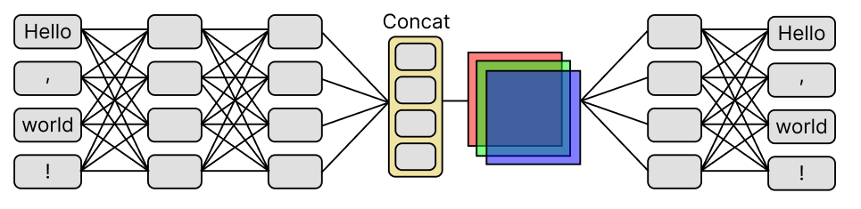

# Code Glyphs

This is an experiment that uses transformers ([codeBERTa](https://huggingface.co/huggingface/CodeBERTa-small-v1)) and a convolutional neural network to learn visual representations of Python code. It can turn arbitrary Python code into a 128x128 RGB image. Of course, a similar system could be retrained on other programming languages, and probably natural language as well.

This is possible by designing the system as an autoencoder with a visual latent space. This is an unusual objective to force on a transformer, but with a low enough learning rate, it does manage to work. With the right hyperparameters, it took roughly a week to train on a TPUv3-8.

I'm using a few tricks to make this work, including perceptual loss and image augmentation. Much of the code to accomplish this is borrowed from an earlier project: [Cooperative Communication Networks](https://github.com/noahtren/Cooperative-Communication-Networks).

## Dataset

The dataset is based on [CodeSearchNet](https://github.com/github/CodeSearchNet). After removing docstrings, every Python function with ≤128 tokens is kept. The final dataset is 213,298 Python functions.

## Models

**Language**: [codeBERTa](https://huggingface.co/huggingface/CodeBERTa-small-v1) is used twice. Once as a text encoder, and again as a text decoder (with a language modeling head.) A similar system in the future could probably benefit from an autoregressive decoder so it would probably look more like [T5](https://arxiv.org/abs/1910.10683) or [GPT](https://cdn.openai.com/research-covers/language-unsupervised/language_understanding_paper.pdf).

**Vision**: A simple generative CNN is defined in `generator.py`. The decoder network (or "discriminator") is a pretrained ResNet-50 from [BiT](https://github.com/google-research/big_transfer). This same network with its weights frozen is used for calculating perceptual loss (called `perceptor` in `models.py`).

### Custom perceptual loss

Perceptual loss is used to encourage images to look different from each other, based on the pretrained weights from BiT. I found that a custom perceptual loss function gave better results: it encourages images to be *as different as the latent vectors of the code that they represent*. The code to do this is the `vector_distance_loss` function in `models.py`.

## Credits

This project was made possible by the [TensorFlow Research Cloud](https://www.tensorflow.org/tfrc) program. Thank you!!
